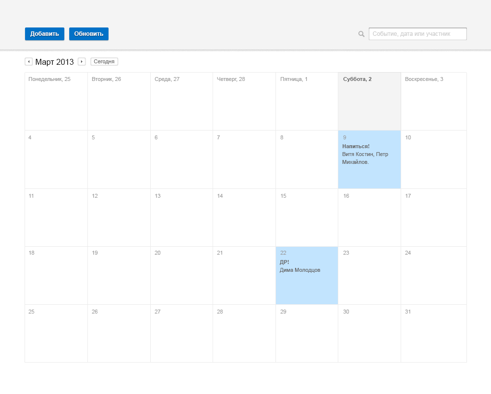
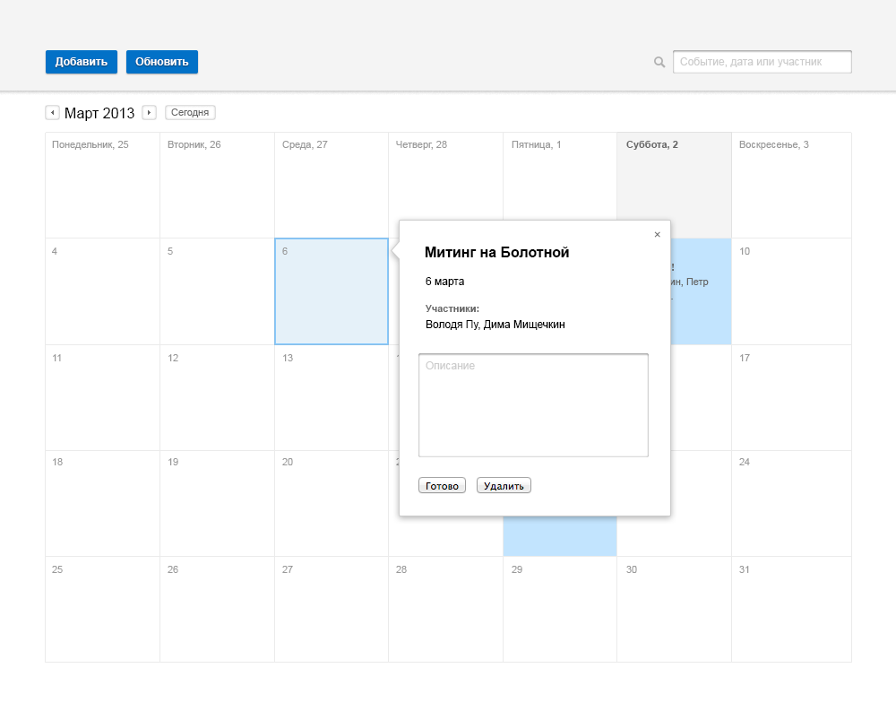

Тестовое задание для разработчика frontend
==========================================

Сверстать страницу календаря в соответствии с макетом ниже.  
Необходимо решить задание с использованием библиотеки bootstrap. Результат разместите на GitHub и в письме пришлите ссылку. 

Плюсом будет реализация любой дополнительной JS-логики работы календаря:
 * добавление/редактирование событий
 * переход по месяцам
 * поиск
 * сохранение календаря в localStorage
 
 
 Большим плюсом будет:
 - реализация приложения на react js
 - реализация серверной части (nodejs+mysql)

### Примеры дополнительной логики работы

Добавление события

Быстрое добавление события

Просмотр события + редактирование описания

Поиск:

